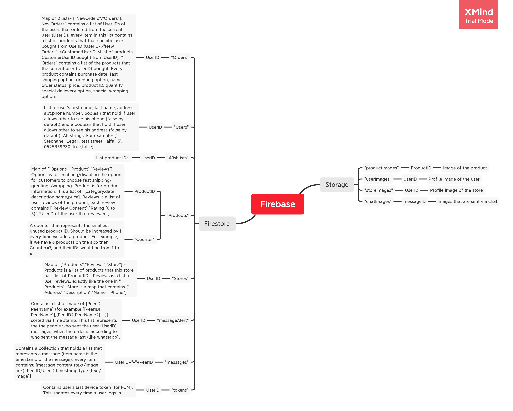

# Firebase

## Storage

### "productImages"

- ProductID

	- Image of the product

### "userImages"

- UserID

	- Profile image of the user

### "storeImages"

- UserID

	- Profile image of the store

### "chatImages"

- messageID

	- Images that are sent via chat

## Firestore

### "Orders"

- UserID

	- Map of 2 lists- ["NewOrders","Orders"]. "NewOrders" contains a list of User IDs of the users that ordered from the current user (UserID), every item in this list contains a list of products that that specific user bought from UserID (UserID->"New Orders"->CustomerUserID->List of products CustomerUserID bought from UserID). "Orders" contains a list of the products that the current user (UserID) bought. Every product contains purchase date, fast shipping option, greeting option, name, order status, price, product ID, quantity, special delievery option, special wrapping option.

### "Users"

- UserID

	- List of user's first name, last name, address,apt,phone number, boolean that hold if user allows other to see his phone (false by default) and a boolean that hold if user allows other to see his address (false by default). All strings. For example: ['Stephane','Legar','test street Haifa','3','0525359930',true,false]

### "Wishlists"

- UserID

	- List product IDs.

### "Products"

- ProductID

	- Map of ["Options","Product","Reviews"]. Options is for enabling/disabling the option for customers to choose fast shipping/greetings/wrapping. Product is for product information, it is a list of  [category,date,description,name,price]. Reviews is a list of user reviews of the product, each review contains ["Review Content","Rating (0 to 5)","UserID of the user that reviewed"].

- "Counter"

	- A counter that represents the smallest unused product ID. Should be increased by 1 every time we add a product. For example, if we have 6 products on the app then Counter=7, and their IDs would be from 1 to 6.

### "Stores"

- UserID

	- Map of ["Products","Reviews","Store"] - Products is a list of products that this store has- list of ProductIDs. Reviews is a list of user reviews, exactly like the one in "Products". Store is a map that contains ["Address","Description","Name","Phone"]

### "messageAlert"

- UserID

	- Contains a list of made of [PeerID,PeerName] (for example,[[PeerID1,PeerName1],[PeerID2,PeerName2],...])  sorted via time stamp. This list represents the the people who sent the user (UserID) messages, when the order is according to who sent the message last (like whatsapp).

### "messages"

- UserID+"-"+PeerID

	- Contains a collection that holds a list that represents a message (item name is the timestamp of the message). Every item contains: [message content (text/image link), PeerID,UserID,timestamp,type (text/image)]

### "tokens"

- UserID

	- Contains user's last device token (for FCM). This updates every time a user logs in.

## You can access files in Storage like this example: FirebaseStorage.instance.ref().child("chatImages/"+fileName);

*XMind - Trial Version*