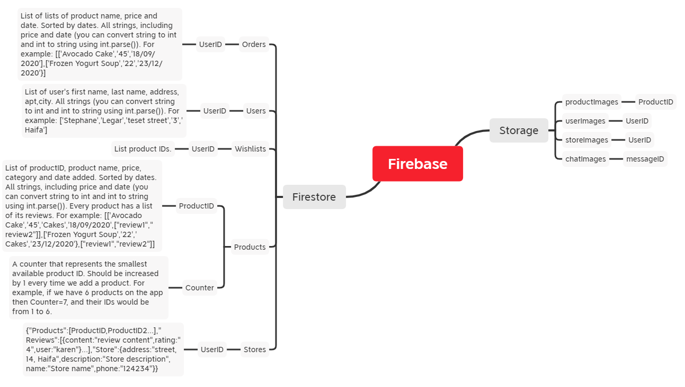

# Firebase

## Storage

### productImages

- ProductID

### userImages

- UserID

### storeImages

- UserID

### chatImages

- messageID

## Firestore

### Orders

- UserID

	- List of lists of product name, price and date. Sorted by dates. All strings, including price and date (you can convert string to int and int to string using int.parse()). For example: [['Avocado Cake','45','18/09/2020'],['Frozen Yogurt Soup','22','23/12/2020'}]

### Users

- UserID

	- List of user's first name, last name, address,apt,city. All strings (you can convert string to int and int to string using int.parse()). For example: ['Stephane','Legar','teset street','3','Haifa']

### Wishlists

- UserID

	- List product IDs.

### Products

- ProductID

	- List of productID, product name, price, category and date added. Sorted by dates. All strings, including price and date (you can convert string to int and int to string using int.parse()). Every product has a list of its reviews. For example: [['Avocado Cake','45','Cakes','18/09/2020',["review1","review2"]],['Frozen Yogurt Soup','22','Cakes','23/12/2020'},["review1","review2"]]

- Counter

	- A counter that represents the smallest available product ID. Should be increased by 1 every time we add a product. For example, if we have 6 products on the app then Counter=7, and their IDs would be from 1 to 6.

### Stores

- UserID

	- {"Products":[ProductID,ProductID2...],"Reviews":[{content:"review content",rating:"4",user:"karen"}...],"Store":{address:"street, 14, Haifa",description:"Store description",name:"Store name",phone:"124234"}}

